# vLLM Orchestrator Deep Agent — 시스템 아키텍처

> 이 문서는 `backend/`, `frontend/`, `config/` 실제 코드를 기준으로 작성했다.
> 모든 다이어그램은 Mermaid 이며, GitHub · IntelliJ · VS Code 에서 그대로 렌더링된다.

## 목차

| # | 다이어그램 | 무엇을 보여주는가 |
|---|---|---|
| 1 | [시스템 전체 구조](#1-시스템-전체-구조) | 프로세스와 외부 의존성 한 장 |
| 2 | [백엔드 패키지 구조](#2-백엔드-패키지-구조) | 도메인 경계와 소유 관계 |
| 3 | [기동 라이프사이클](#3-기동-라이프사이클) | lifespan 조립 순서 |
| 4 | [모니터 채팅 스트리밍](#4-모니터-채팅-스트리밍-post-stream) | `/stream` 한 턴의 전체 경로 |
| 5 | [그래프 조립과 미들웨어 체인](#5-그래프-조립과-미들웨어-체인) | 체크포인트를 지키는 핵심 원칙 |
| 6 | [모델 카탈로그와 능력 선언](#6-모델-카탈로그와-능력-선언) | models.yaml 이 그래프 모양을 정한다 |
| 7 | [비동기 Job 시스템](#7-비동기-job-시스템) | 제출 · 실행 · 구독 · 복구 |
| 8 | [스트림 파이프라인](#8-스트림-파이프라인-청크-정규화) | raw 청크에서 저장 가능한 형태로 |
| 9 | [오케스트레이터 그래프](#9-오케스트레이터-그래프) | 서브에이전트 트리 |
| 10 | [이미지와 비전 파이프라인](#10-이미지와-비전-파이프라인) | 업로드 · 격리 · 전환 · 인계 |
| 11 | [컨텍스트 압축](#11-컨텍스트-압축) | 요약 생성과 프롬프트 재구성 |
| 12 | [인증과 토큰 갱신](#12-인증과-토큰-갱신) | 무상태 HMAC 토큰 |
| 13 | [데이터 모델](#13-데이터-모델-erd) | 테이블 관계 |
| 14 | [프론트엔드 구조](#14-프론트엔드-구조) | 컴포넌트와 훅 의존 |
| 15 | [Redis 키 맵](#15-redis-키-맵) | 키 네임스페이스와 TTL |

---

## 1. 시스템 전체 구조

하나의 FastAPI 프로세스(`backend/server.py`)가 **세 라우트 계열**을 함께 호스팅한다.
같은 PostgreSQL 체크포인트와 Redis 인프라를 공유하되, **서로 다른 그래프**를 쓴다.

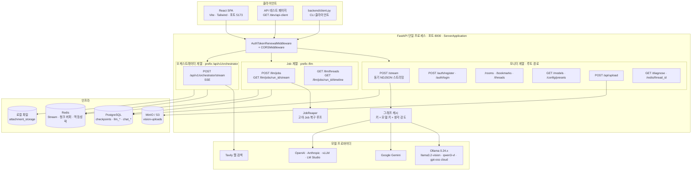

### 세 계열의 차이

| | 모니터 `/stream` | Job `/llm/jobs` | 오케스트레이터 |
|---|---|---|---|
| 실행 방식 | 요청-응답 동안 직접 `astream` | 202 즉시 반환 후 백그라운드 태스크 | 요청-응답 동안 SSE |
| 전송 형식 | NDJSON 또는 평문 | SSE + `Last-Event-ID` 재개 | SSE |
| 상태 저장 | LangGraph 체크포인트 | `llm_job*` 테이블 + Redis Stream | Redis 버퍼 후 벌크 저장 |
| 끊김 복구 | 없음 (브라우저 재요청) | `JobReaper` + PostgreSQL 폴백 | 없음 |
| 그래프 | Trimming → Stripping → Compression | `DeepAgentFactory` 기본 | Tavily + 리서치 서브에이전트 |

---

## 2. 백엔드 패키지 구조

`backend/app` 은 도메인별로 갈라지고, `backend/common` 은 도메인을 모르는 순수 인프라다.

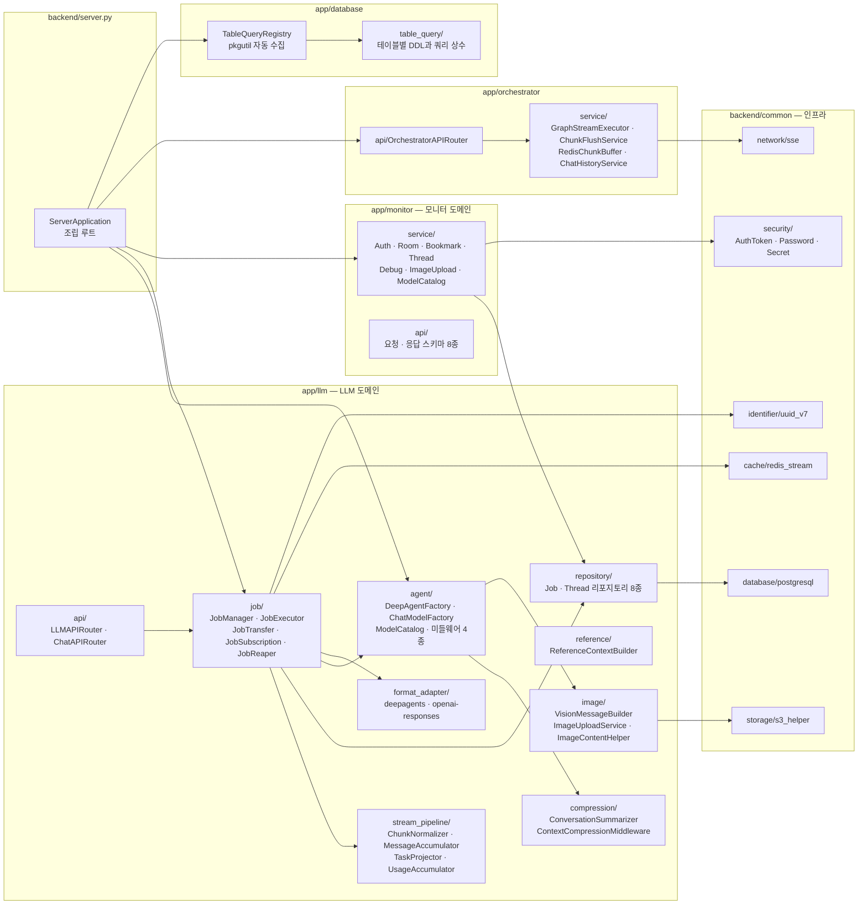

### 코드 규칙

- **파일 하나에 클래스 하나.** 예외 없음 — `job_status.py` 는 `JobStatus` 만 담는다.
- **`__init__.py` 없음.** 네임스페이스 패키지라 `TableQueryRegistry` 는 `pkgutil` 로 경로를 직접 훑는다.
- **테이블 추가는 파일 하나로 끝난다.** `table_query/{테이블명}_query.py` 를 만들면
  `CREATION_ORDER` 순서대로 자동 수집되어 DDL 이 실행된다. 등록 목록을 손대지 않는다.
- **인덱스 문서 동기화.** 모든 소스는 `.claude/index/` 아래 같은 트리로 `.md` 대응본을 갖는다.

---

## 3. 기동 라이프사이클

DB 풀이 필요한 서비스는 `__init__` 에서 `None` 으로 두고 **lifespan 에서 조립**한다.
순환 의존을 피하려고 `ThreadService` 와 `ReferenceContextBuilder` 는 그래프를 **콜러블(lambda)** 로 받는다.

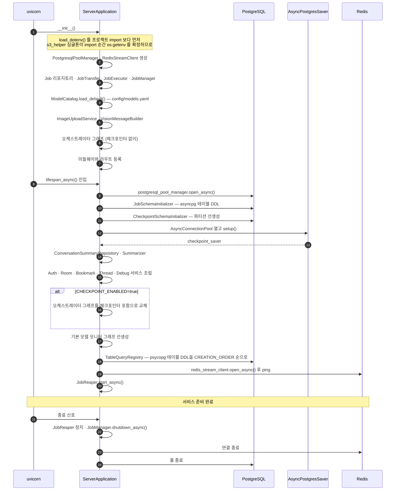

> ⚠️ **반드시 프로젝트 루트에서 실행한다.** `MODEL_CATALOG_PATH` 가 상대 경로라
> `backend/` 에서 띄우면 카탈로그를 못 찾고 `.env` 폴백으로 떨어져
> `OPENAI_API_KEY` 오류로 위장된 기동 실패가 난다.
>
> Windows 에서는 `SelectorEventLoop` 로 직접 구동한다 — uvicorn 기본인 `ProactorEventLoop` 를
> psycopg 비동기 체크포인터가 지원하지 않는다.

---

## 4. 모니터 채팅 스트리밍 (POST /stream)

프론트가 실제로 쓰는 주 경로다. 한 턴이 지나가는 전 구간이다.

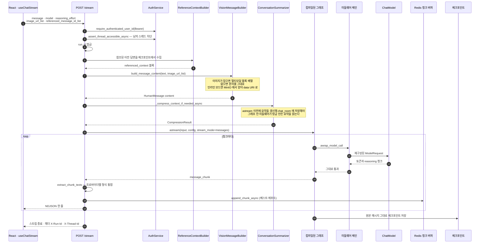

### NDJSON 이벤트 종류

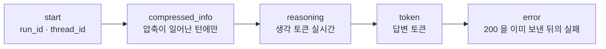

> `include_reasoning=false` 면 NDJSON 이 아니라 **평문 텍스트**가 흐른다.
> 이 모드에서 `compressed_info` 를 섞으면 본문이 오염되므로 생략한다.

### 프로바이더별 청크 형식 통합

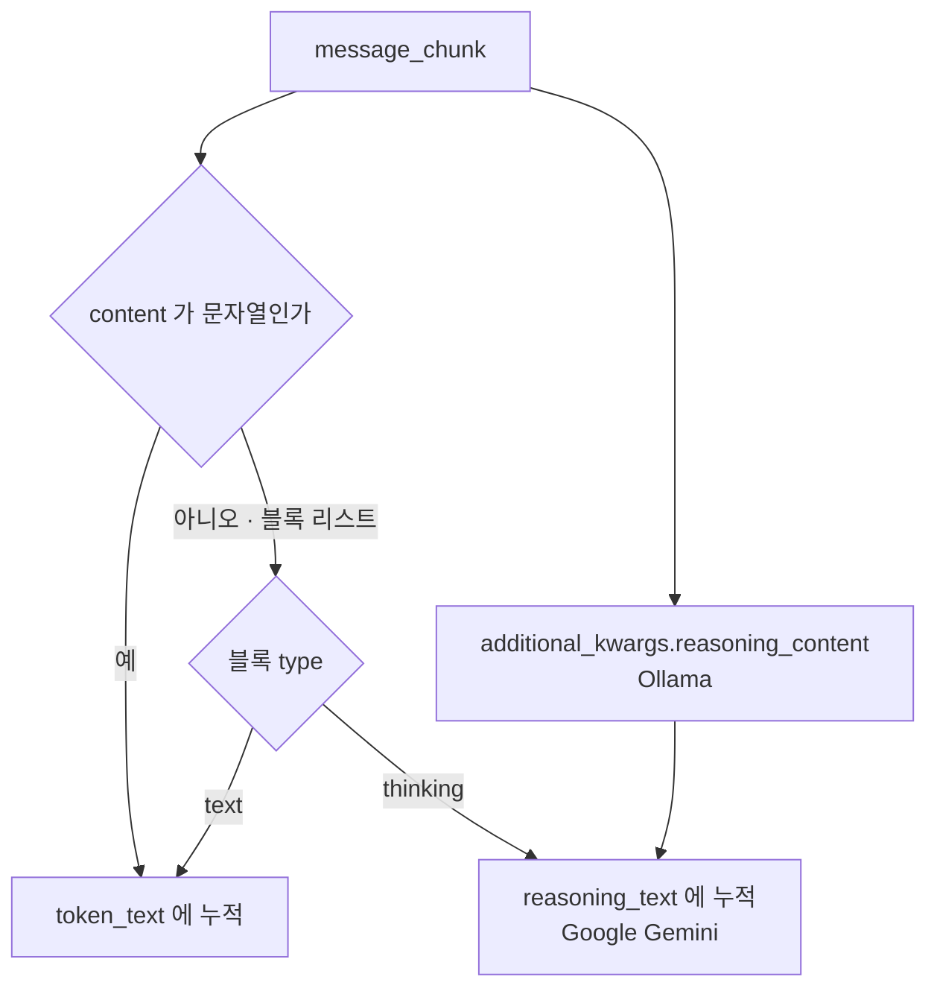

### 실패 처리 원칙

| 실패 지점 | 처리 |
|---|---|
| Redis 청크 버퍼 | `is_run_buffer_disabled=True` 로 끄고 **스트리밍은 계속** |
| 대화 압축 | 예외를 삼키고 "압축 안 함" 으로 진행 |
| 모델 호출 | 이미 200 헤더를 보냈으므로 HTTP 상태로 못 알림 → **본문에 error 이벤트** |

---

## 5. 그래프 조립과 미들웨어 체인

이 프로젝트의 **가장 중요한 설계 원칙**이 여기 있다.

> **체크포인트(원본 상태)는 절대 건드리지 않고, 모델에게 보내는 프롬프트만 갈아끼운다.**
> `before_model` 훅은 반환값이 체크포인트에 다시 기록되므로 쓰지 않는다.
> `awrap_model_call` 은 `ModelRequest` 만 override 하고 State 는 그대로 둔다.

이 원칙을 어기면 사용자가 위로 스크롤했을 때 지난 대화가 요약본으로 바뀌어 있거나,
격리해 둔 이미지가 MB 급으로 되살아나 영속화된다.

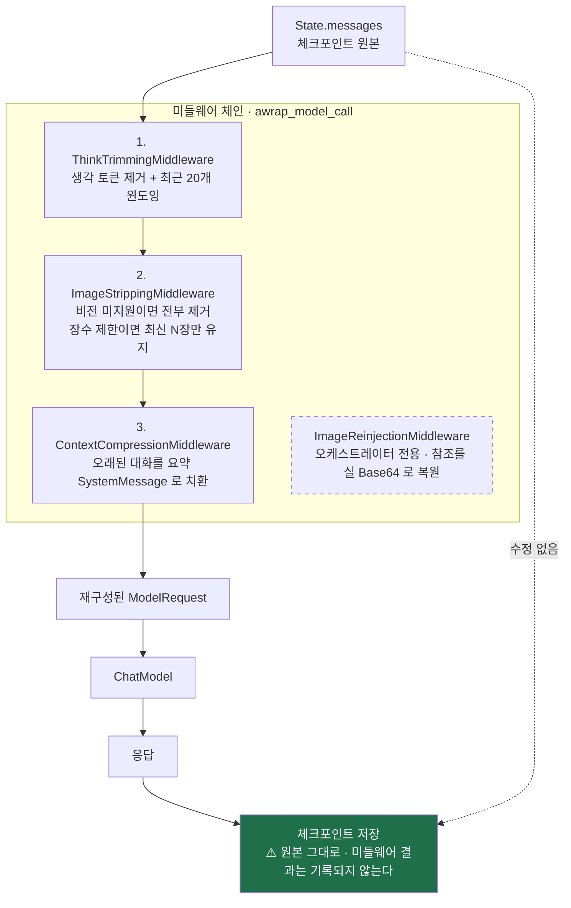

### 체인 순서가 중요한 이유

압축 미들웨어는 **트리밍 뒤**에 온다. 생각 토큰이 걷힌 뒤의 메시지를 기준으로 창을 잡아야
요약과 최근 원본이 같은 기준으로 정렬된다.

### 그래프 캐시

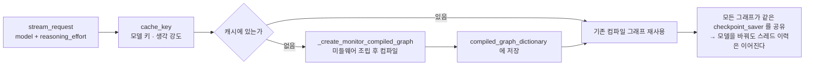

---

## 6. 모델 카탈로그와 능력 선언

`config/models.yaml` 의 **능력 선언이 그래프 모양을 결정한다.** 이 프로젝트가 세 번의 400 장애를
해결하며 정착시킨 패턴이다.

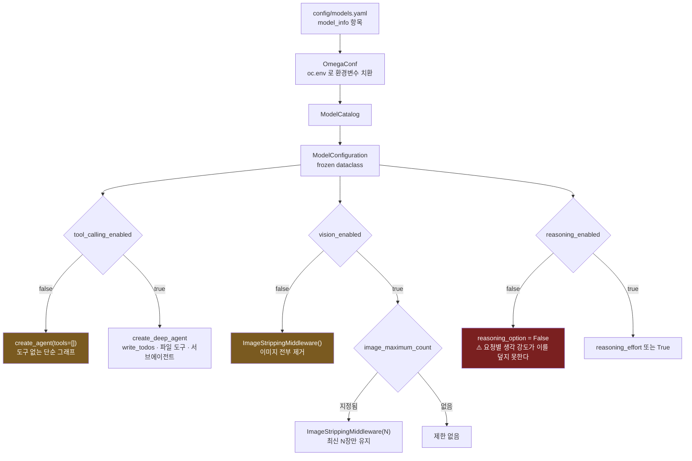

### 능력 선언이 막아 주는 실제 장애

| 선언 | 없으면 나는 오류 | 왜 |
|---|---|---|
| `reasoning_enabled: false` | `400 "llama3.2-vision" does not support thinking` | UI 의 생각 강도가 카탈로그를 덮어써 `think` 가 전송됨 |
| `tool_calling_enabled: false` | `400 ... does not support tools` | `create_deep_agent` 는 도구를 **항상** 바인딩한다 |
| `vision_enabled: false` | `400 this model does not support image input` | 옛 이미지가 체크포인트에 남아 매 턴 재전송된다 |
| `image_maximum_count: 1` | `400 this model only supports one image` | 대화가 이어질수록 이미지가 쌓인다 |
| `temperature: 0.6` `top_p: 0.9` `repeat_penalty: 1.1` | 같은 구절 무한 반복 (실측 반복도 0.95) | `temperature: 0.0` 그리디 디코딩의 한국어 퇴화 |

> `reasoning_enabled: false` 는 "생각을 끄고 싶다" 가 아니라
> **"이 모델은 thinking 을 지원하지 않는다"** 는 선언이다. 요청 파라미터로 덮을 수 없다.

### 현재 카탈로그

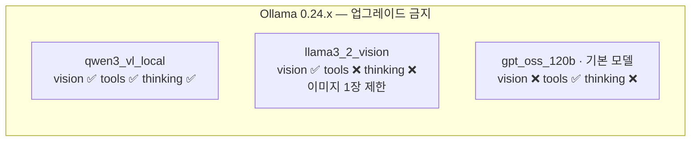

> ⚠️ Ollama 0.30.0+ 는 `mllama` 아키텍처를 버려 `llama3.2-vision` 이 로드 자체에 실패한다
> (`unknown model architecture: 'mllama'`). 자동 업데이트를 꺼 둔 상태다.

---

## 7. 비동기 Job 시스템

### 7-1. Job 상태 전이

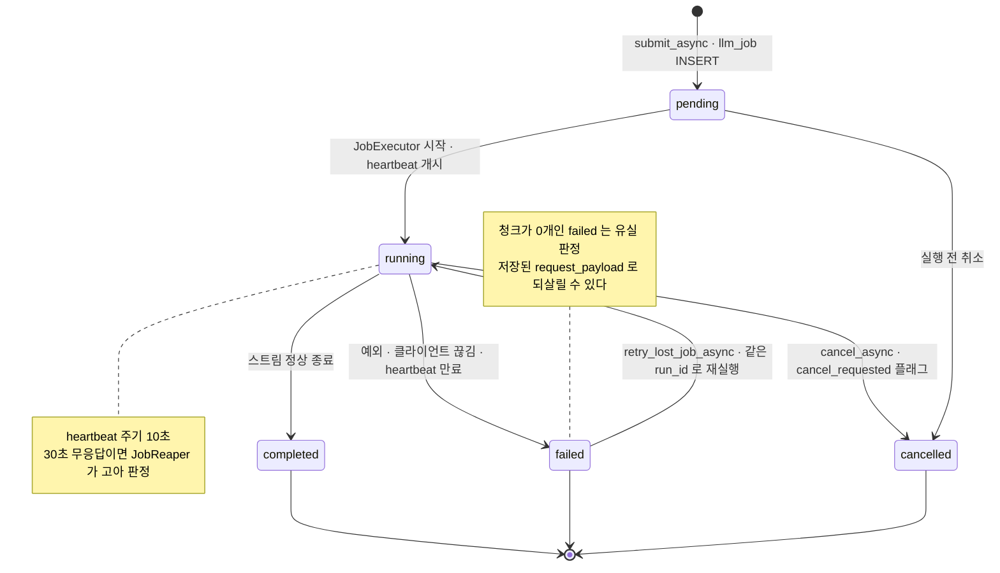

### 7-2. 제출부터 구독까지

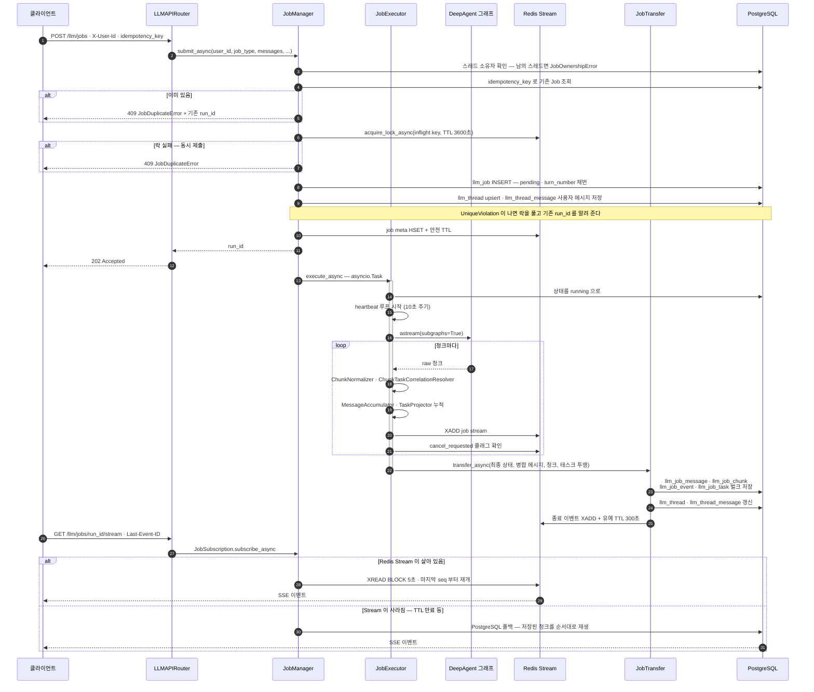

**멱등성은 3중으로 막는다.** DB 조회 → Redis 락 → `UniqueViolationError` 포착.
어느 층에서 걸리든 `JobDuplicateError` 에 기존 `run_id` 를 실어 돌려주고,
그 `run_id` 가 **요청자 본인의 것일 때만** 노출한다 (남의 run_id 유출 방지).

### 7-3. 고아 Job 복구 (JobReaper)

`JobReaper` 는 재시작하지 않는다. **`failed` 로 확정 짓는 역할**이다 —
Redis 만 보고 판단하면 Redis 메타 자체가 사라진 Job 을 놓치므로 경로가 둘이다.

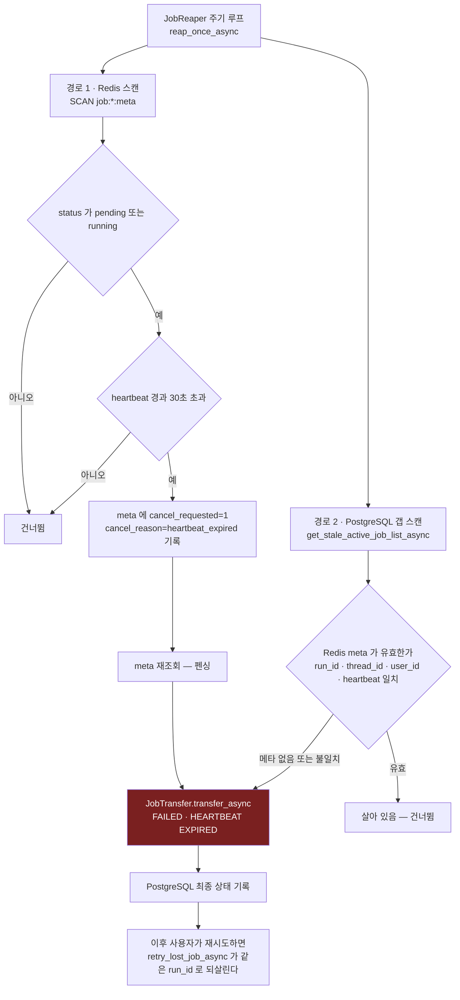

경로 2 가 잡아내는 것은 **Redis 메타가 통째로 사라진 Job** 이다. 프로세스가 죽거나
Redis 가 비워지면 경로 1 의 스캔에 아예 걸리지 않으므로, PostgreSQL 쪽에서
`running` 인 채 오래된 Job 을 역으로 훑는다.

### 7-4. 유실 복구 (retry_lost_job_async)

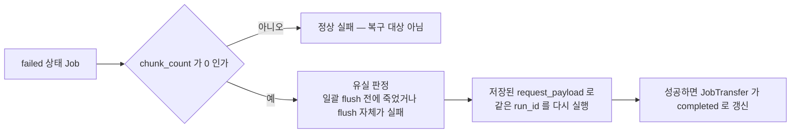

### 7-5. 설정값

| 설정 | 기본값 | 의미 |
|---|---|---|
| `execution_timeout_second_count` | 3600 | 작업 실행 시간 상한 |
| `redis_safety_ttl_second_count` | 3900 | 실행 중 Redis 안전 TTL |
| `redis_grace_ttl_second_count` | 300 | 종료 후 재구독 유예 |
| `redis_stream_maximum_length` | 10000 | Stream 근사 최대 길이 |
| `heartbeat_interval_second_count` | 10 | heartbeat 갱신 주기 |
| `heartbeat_expire_second_count` | 30 | 고아 판정 시간 |
| `xread_block_millisecond_count` | 5000 | XREAD BLOCK 대기 |
| `idempotency_lock_ttl_second_count` | 3600 | 멱등성 락 TTL |

---

## 8. 스트림 파이프라인 (청크 정규화)

LangGraph 의 raw 청크를 **저장 가능하고 재생 가능한** 형태로 바꾸는 계층이다.

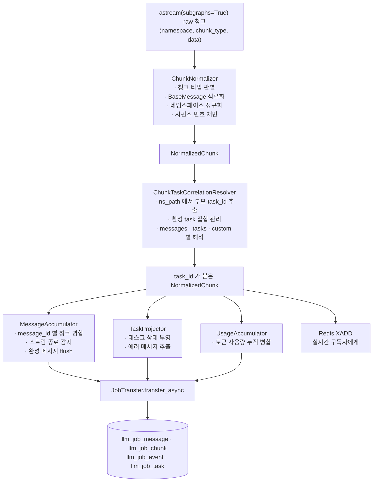

### 출력 형식 어댑터

같은 저장 데이터를 두 형식으로 재생할 수 있다.

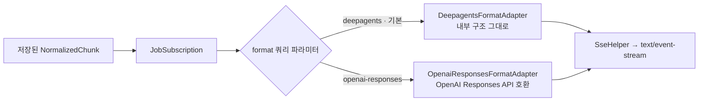

---

## 9. 오케스트레이터 그래프

`TAVILY_API_KEY` 가 있으면 **메인 에이전트 → task() 위임 → 리서치 서브에이전트** 트리로 컴파일된다.
없으면 단일 노드 그래프가 된다.

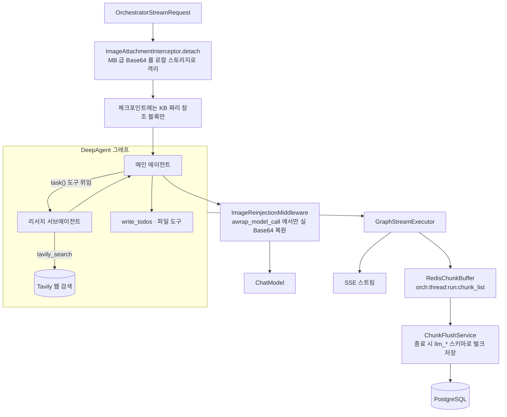

> 서브에이전트가 붙으면 `astream(subgraphs=True)` 청크에 **다단계 네임스페이스(ns_path)** 가 쌓인다.
> `ChunkTaskCorrelationResolver` 가 이걸 풀어 부모-자식 태스크 관계를 복원한다.

---

## 10. 이미지와 비전 파이프라인

이 프로젝트에서 가장 많은 장애가 났던 영역이라 경로가 셋으로 나뉜다.

### 10-1. 업로드부터 모델 입력까지

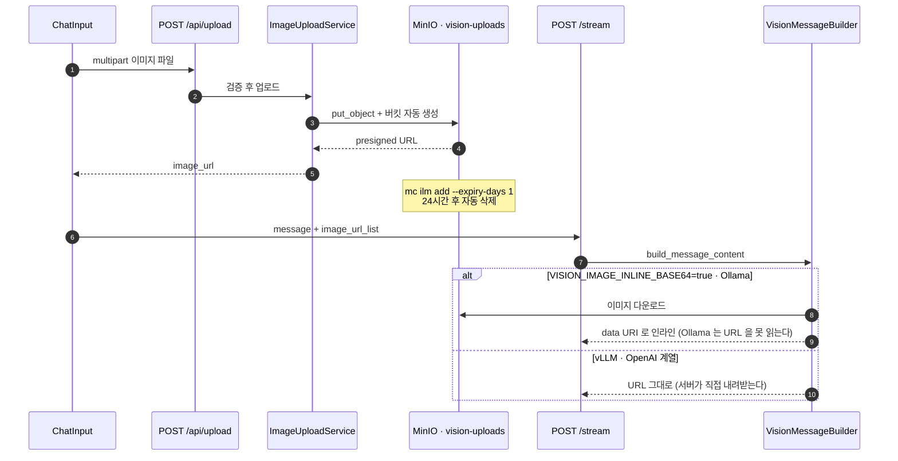

### 10-2. 이미지 첨부 시 자동 모델 전환

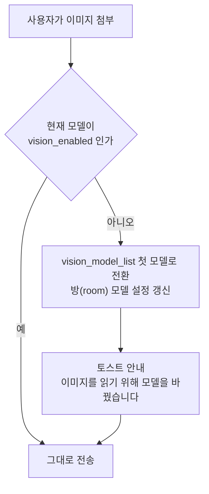

`GET /models` 응답이 `vision_model_list` 를 함께 내려 주기 때문에 프론트가 판단할 수 있다.

### 10-3. 비전 답변을 텍스트 모델에게 인계하기

이미지를 그냥 걷어내면 텍스트 모델이 **"저는 이미지를 볼 수 없습니다"** 로 거절해 버린다.
비전 모델이 이미 설명해 둔 내용이 대화에 있어도 쓰지 않는다. 그래서 **설명을 이미지 자리에 실어 준다.**

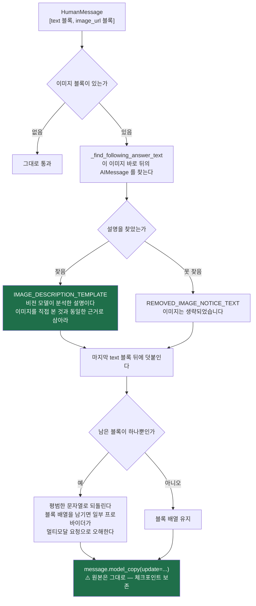

### 10-4. 두 가지 격리 방식 비교

| | `ImageStrippingMiddleware` (모니터) | `ImageAttachmentInterceptor` (오케스트레이터) |
|---|---|---|
| 목적 | 모델이 **못 읽는** 이미지를 프롬프트에서 뺀다 | 체크포인트 **크기**를 줄인다 |
| 시점 | `awrap_model_call` 한 곳 | detach 는 라우터, reinject 는 `awrap_model_call` |
| 체크포인트 | 원본 이미지 그대로 | KB 짜리 참조 블록만 |
| 모델이 받는 것 | 이미지 없음 또는 최신 N장 | 복원된 실 Base64 |
| 대체 텍스트 | 비전 모델의 설명을 실어 준다 | 해당 없음 |

---

## 11. 컨텍스트 압축

```mermaid
sequenceDiagram
    autonumber
    participant ST as stream_async
    participant CS as ConversationSummarizer
    participant CP as 체크포인트
    participant SM as 요약 전용 ChatModel
    participant CR as chat_room 테이블
    participant MW as ContextCompressionMiddleware
    participant M as 본 대화 ChatModel

    ST->>CP: aget_state — 전체 히스토리
    CP-->>CS: message_list
    CS->>CS: 임계치 확인
    Note over CS: 메시지 14개 초과 또는 토큰 3000 초과
    alt 임계치 미달
        CS-->>ST: CompressionResult.uncompressed
    else 임계치 초과
        CS->>SM: 오래된 대화를 4줄로 요약
        Note over SM: dataclasses.replace 로 사본 생성<br/>reasoning 끄고 생성 상한 512 토큰
        SM-->>CS: 요약문
        CS->>CR: chat_room 에 요약 저장
        CS-->>ST: CompressionResult.compressed
    end

    ST->>M: astream 시작
    M->>MW: awrap_model_call
    MW->>CR: 방금 저장된 요약 읽기
    MW->>MW: 요약 SystemMessage + 최근 10개 원본으로 재구성
    MW->>M: 재구성된 ModelRequest
    Note over CP: ⚠️ 체크포인트에는 원본 전체가 그대로 남는다<br/>사용자가 위로 스크롤하면 지난 대화가 보인다
```

| 환경변수 | 기본값 | 의미 |
|---|---|---|
| `CONTEXT_COMPRESSION_ENABLED` | true | 전체 on/off |
| `CONTEXT_COMPRESSION_RECENT_KEEP_COUNT` | 10 | 원본으로 남길 최근 메시지 수 |
| `CONTEXT_COMPRESSION_TRIGGER_MESSAGE_COUNT` | 14 | 메시지 수 임계치 |
| `CONTEXT_COMPRESSION_TRIGGER_TOKEN_COUNT` | 3000 | 토큰 수 임계치 |
| `CONTEXT_COMPRESSION_SUMMARY_LINE_COUNT` | 4 | 요약 줄 수 |
| `CONTEXT_COMPRESSION_SUMMARY_MAXIMUM_TOKEN_COUNT` | 512 | 요약 생성 상한 |

---

## 12. 인증과 토큰 갱신

```mermaid
sequenceDiagram
    autonumber
    participant FE as 프론트엔드
    participant MW as AuthTokenRenewalMiddleware
    participant AS as AuthService
    participant UR as UserRepository
    participant PG as chat_user

    FE->>AS: POST /auth/register · user_id + password
    AS->>UR: PasswordHelper 로 해시 후 저장
    UR->>PG: INSERT

    FE->>AS: POST /auth/login
    AS->>UR: 비밀번호 검증
    AS->>AS: AuthTokenHelper — HMAC 서명 토큰 발급
    AS-->>FE: token · TTL 기본 7일

    FE->>MW: 이후 모든 요청 · Authorization Bearer
    MW->>MW: 서명 검증 후 남은 수명 확인
    alt 남은 수명이 절반 아래
        MW-->>FE: X-Refreshed-Auth-Token 헤더로 새 토큰
        FE->>FE: localStorage 갱신
    end
    MW->>AS: 라우트 핸들러로 통과
```

### 비밀키 고정

```mermaid
graph LR
    A["AUTH_TOKEN_SECRET 환경변수"] -->|"있으면"| USE["이 값 사용"]
    A -->|"없으면"| B[".auth_token_secret 파일"]
    B -->|"있으면"| USE
    B -->|"없으면"| C["새로 만들어 파일에 저장"] --> USE
    USE --> NOTE["재시작해도 같은 값<br/>→ 발급해 둔 토큰이 살아남는다"]
    style NOTE fill:#1f6f4a,color:#fff
```

> 예전에는 환경변수가 없으면 매 기동마다 `secrets.token_hex()` 로 새로 만들었다.
> 그 탓에 서버를 재시작할 때마다 모든 사용자가 로그아웃됐다.

토큰은 **무상태 HMAC** 이라 DB 에서 사용자를 지워도 기존 토큰은 계속 통과한다.
소유권 검증(`assert_thread_accessible_async`)이 별도로 존재하는 이유다.

---

## 13. 데이터 모델 ERD

테이블은 **세 무리**로 나뉜다. 실제 외래키 제약이 걸린 곳은 `chat_bookmark → chat_room` 하나뿐이고,
나머지는 애플리케이션이 지키는 논리적 관계다.

### 13-1. 모니터 계열 (psycopg · 체크포인트 풀 공유)

```mermaid
erDiagram
    chat_user ||--o{ chat_room : "user_id"
    chat_room ||--o{ chat_bookmark : "room_id · ON DELETE CASCADE"

    chat_user {
        TEXT user_id PK
        TEXT password_hash
        TIMESTAMPTZ created_at
    }
    chat_room {
        TEXT room_id PK
        TEXT user_id
        TEXT thread_id "체크포인트 thread_id 와 연결"
        TEXT title
        TEXT model "카탈로그 키"
        TEXT reasoning_effort
        TEXT summary "압축 요약"
        INTEGER summarized_message_count
        TIMESTAMPTZ summary_updated_at
        TIMESTAMPTZ updated_at
    }
    chat_bookmark {
        TEXT bookmark_id PK
        TEXT user_id
        TEXT room_id FK
        INTEGER agent_index "room_id 와 UNIQUE"
        TEXT text
        TEXT memo
        TIMESTAMPTZ completed_at
    }
```

> `chat_bookmark` 는 `ON DELETE CASCADE` 다. **북마크를 해제하면 메모도 함께 사라진다** —
> 버그가 아니라 의도된 동작이므로 메모 보존 로직을 따로 넣지 않는다.

### 13-2. Job 계열 (asyncpg 풀)

```mermaid
erDiagram
    llm_thread ||--o{ llm_job : "thread_id"
    llm_thread ||--o{ llm_thread_message : "thread_id"
    llm_job ||--o{ llm_job_message : "run_id"
    llm_job ||--o{ llm_job_chunk : "run_id"
    llm_job ||--o{ llm_job_event : "run_id"
    llm_job ||--o{ llm_job_task : "run_id"
    llm_job ||--o{ llm_thread_message : "run_id"

    llm_job {
        UUID run_id PK
        UUID thread_id
        UUID user_id
        VARCHAR job_type "sync · async"
        VARCHAR status "pending running completed failed cancelled"
        VARCHAR output_format "deepagents · openai-responses"
        JSONB request_payload
        JSONB usage
        TEXT error_message
        INTEGER last_sequence_number
        INTEGER chunk_count
        INTEGER task_count
        INTEGER turn_number
        BOOLEAN has_complete_chunk_history
        VARCHAR idempotency_key
        TIMESTAMPTZ started_at
        TIMESTAMPTZ completed_at
    }
    llm_thread {
        UUID thread_id PK
        UUID user_id
        TEXT title
        TEXT last_message_preview
        UUID latest_run_id
        VARCHAR latest_status
        TIMESTAMPTZ updated_at
    }
    llm_job_message {
        UUID id PK
        UUID run_id
        UUID thread_id
        VARCHAR message_id "run_id · ns_path 와 UNIQUE"
        TEXT ns_path "서브에이전트 네임스페이스"
        VARCHAR task_id
        VARCHAR parent_task_id
        VARCHAR agent_name
        BOOLEAN is_root_message
        VARCHAR role
        JSONB content
        JSONB tool_call_list
        JSONB usage
        INTEGER seq_first
        INTEGER seq_last
    }
    llm_job_chunk {
        UUID id PK
        UUID run_id
        INTEGER seq "run_id 와 UNIQUE · CHECK seq 양수"
        VARCHAR chunk_type "tasks · messages · custom"
        JSONB ns_list
        TEXT ns_path
        VARCHAR task_id
        VARCHAR parent_task_id
        VARCHAR task_link_type
        JSONB data
        VARCHAR stream_version "langgraph-v2"
        VARCHAR projection_status
    }
    llm_job_event {
        UUID id PK
        UUID run_id
        INTEGER seq
        VARCHAR chunk_type
        TEXT ns_path
        JSONB data
    }
    llm_job_task {
        UUID run_id PK
        VARCHAR task_id PK
        VARCHAR parent_task_id
        VARCHAR task_name
        VARCHAR agent_name
        VARCHAR status
        JSONB input
        JSONB result
        TEXT error_message
        JSONB interrupt_list
        INTEGER started_sequence_number
        INTEGER completed_sequence_number
        BOOLEAN is_status_inferred
    }
    llm_thread_message {
        UUID id PK
        UUID thread_id
        UUID run_id
        INTEGER turn_number
        INTEGER message_order "run_id · role 과 UNIQUE"
        VARCHAR role
        TEXT content
        VARCHAR source_message_id
        VARCHAR source_task_id
        BOOLEAN is_display_message
    }
```

`llm_job_chunk` 는 **원본 청크**, `llm_job_message` 는 **병합된 최종 메시지**,
`llm_thread_message` 는 **화면에 보여줄 대화**다. 같은 데이터의 세 가지 해상도다.

### 13-3. LangGraph 체크포인트 (해시 파티셔닝)

`langgraph-checkpoint-postgres` 의 기본 스키마를 그대로 쓰지 않고,
`CheckpointSchemaInitializer` 가 **파티션 테이블로 선생성**한 뒤 마이그레이션 버전 행을 주입한다.
그래서 `setup()` 은 신규 마이그레이션이 없는 한 no-op 이다.

```mermaid
graph TB
    subgraph PART["PARTITION BY HASH thread_id · 기본 8개"]
        CPS["checkpoints<br/>PK: thread_id · checkpoint_ns · checkpoint_id"]
        CPB["checkpoint_blobs<br/>PK: thread_id · ns · channel · version<br/>⚠️ 이미지 base64 가 여기 남는다"]
        CPW["checkpoint_writes<br/>PK: thread_id · ns · checkpoint_id · task_id · idx"]
    end
    MIG["checkpoint_migrations<br/>버전 행 선주입 → setup() 은 no-op"]
    RET["CheckpointRetentionService<br/>backend/checkpoint_retention_batch.py"]
    RET -->|"오래된 체크포인트 정리"| PART
```

세 테이블 모두 PK 가 `thread_id` 로 시작하므로 `PARTITION BY HASH (thread_id)` 가
PK 제약과 충돌하지 않는다. 파티션 수는 `CHECKPOINT_PARTITION_COUNT` (기본 8).

> **`checkpoint_blobs` 가 이 프로젝트의 이미지 장애 진원지다.** 한 번 붙인 이미지는
> 여기 base64 로 영속되어 매 턴 프롬프트에 재전송된다. 그래서 미들웨어가
> "체크포인트는 그대로 두고 프롬프트에서만 걷어내는" 방식을 쓴다 ([5장](#5-그래프-조립과-미들웨어-체인) 참고).

### 생성 순서 (CREATION_ORDER)

```mermaid
graph LR
    A["5 · chat_user"] --> B["10 · chat_room"] --> C["20 · chat_bookmark"]
    D["110 · llm_job"] --> E["120 · llm_thread"] --> F["130 · llm_job_message"]
    F --> G["140 · llm_thread_message"] --> H["150 · llm_job_chunk"]
    H --> I["160 · llm_job_task"] --> J["170 · llm_job_event"]
```

작은 값이 먼저 만들어진다. 외래키가 걸린 테이블은 참조 대상보다 뒤 번호를 받는다.

---

## 14. 프론트엔드 구조

React 18 + Vite + Tailwind. TypeScript 가 아니라 **JSX** 다.

```mermaid
graph TB
    MAIN["main.jsx"] --> APP["App.jsx<br/>상태 오케스트레이션"]

    subgraph HOOKS["훅 — 관심사별 상태"]
        H1["useRooms<br/>방 목록 · 활성 방 · 방별 모델·생각강도"]
        H2["useChatStream<br/>NDJSON 파싱 · 스트리밍 상태"]
        H3["useBookmarks<br/>북마크와 메모"]
        H4["useTTS<br/>speechSynthesis · 창당 하나"]
        H5["useSTT<br/>마이크 · 창당 하나"]
        H6["useTheme · useToast"]
    end

    subgraph COMPONENTS["컴포넌트"]
        SIDE["Sidebar"] --> RL["RoomList"]
        SIDE --> BL["BookmarkList"]
        HEAD["ChatHeader<br/>모델 선택 · 상태 표시"]
        LIST["ChatMessageList"] --> UM["UserMessage"]
        LIST --> AM["AgentMessage"] --> RT["ReferenceableText<br/>우클릭 참조 · 발췌"]
        LIST --> SAM["StreamingAgentMessage"]
        AM --> ML["MetaLine<br/>TTFT · 토큰 수"]
        INPUT["ChatInput<br/>이미지 첨부 · 참조 칩 · 마이크"]
        INPUT --> REP["ReasoningEffortPopover<br/>톱니바퀴 · 토글 + 낮음·보통·높음"]
        MODAL["ResetConfirmModal"]
        TOAST["ToastContainer"]
    end

    APP --> HOOKS
    APP --> SIDE
    APP --> HEAD
    APP --> LIST
    APP --> INPUT
    APP --> MODAL
    APP --> TOAST

    subgraph API["api/chatApi.js"]
        AF["authFetch<br/>Bearer 부착 + X-Refreshed-Auth-Token 반영"]
        SC["streamChatTurnAsync<br/>onStart · onReasoning · onToken · onStreamError"]
        UPL["uploadImageAsync"]
        LM["listModelsAsync"]
    end

    H2 --> SC
    APP --> LM
    APP --> UPL
    SC --> AF
```

### 브라우저에 남는 상태

```mermaid
graph LR
    LS["localStorage"] --> K1["auth_token · user_id"]
    LS --> K2["input_draft<br/>401 로 튕겨도 쓰던 문장 보존"]
    LS --> K3["developer_mode"]
    LS --> K4["api_url"]
    LS --> K5["theme"]
```

> `takeLogoutReasonText()` 는 **모듈 로드 시점에 한 번만** 꺼낸다.
> 컴포넌트 안에서 꺼내면 StrictMode 의 이중 마운트 때 첫 마운트가 값을 소비해 버리고,
> 실제로 화면에 남는 두 번째 마운트는 빈 값을 읽어 안내가 뜨지 않는다.

### 생각 강도 UI 통합

`파라미터 프리셋` 과 `생각 정도` 는 같은 것이었다. 입력창의 `<select>` 를 없애고
톱니바퀴 팝오버 하나로 합쳤다.

```mermaid
graph LR
    GEAR["톱니바퀴 아이콘"] --> POP["ReasoningEffortPopover"]
    POP --> TOG{"사용 토글"}
    TOG -->|"끔"| OFF["reasoning_effort = null<br/>lastEffortRef 에 직전 값 기억"]
    TOG -->|"켬"| CARDS["낮음 · 보통 · 높음 카드"]
    CARDS --> ROOM["방별 값으로 저장"]
    OFF --> ROOM
```

---

## 15. Redis 키 맵

```mermaid
graph TB
    subgraph JOBKEYS["Job 계열 — RedisKeyBuilder"]
        K1["job:{run_id}:meta<br/>HASH · status · heartbeat · last_seq<br/>TTL 3900초 실행중 / 300초 종료후"]
        K2["job:{run_id}:stream<br/>STREAM · XADD 청크<br/>MAXLEN 근사 10000"]
        K3["inflight:{idempotency_key}<br/>STRING · SETNX 락<br/>TTL 3600초"]
    end

    subgraph ORCHKEYS["오케스트레이터 · 모니터 공용"]
        K4["orch:{thread_id}:run:{run_id}:chunk_list<br/>LIST · 디버그 패널 조회용"]
    end

    NOTE["해시태그 {} 로 감싼 이유<br/>Redis Cluster 에서 같은 run_id 키가<br/>같은 슬롯에 모이도록"]
    K1 --> NOTE
    K2 --> NOTE
```

`GET /redis/{thread_id}` 가 `orch:` 키를 읽어 디버그 패널에 스냅샷을 보여준다.

---

## 부록 — 설계 원칙 요약

```mermaid
mindmap
  root(("설계 원칙"))
    체크포인트 불변
      awrap_model_call 만 사용
      before_model 금지
      원본은 스크롤하면 그대로 보인다
    능력은 카탈로그가 선언
      models.yaml 이 그래프 모양을 정한다
      요청 파라미터가 카탈로그를 덮지 못한다
      기본값은 항상 기존 동작
    실패는 격리한다
      Redis 실패가 스트리밍을 막지 않는다
      압축 실패는 압축 안 함으로 떨어진다
      200 이후 오류는 본문 이벤트로
    파일 하나에 클래스 하나
      init 파일 없음
      테이블 추가는 파일 하나로
      인덱스 문서 동기화
```
